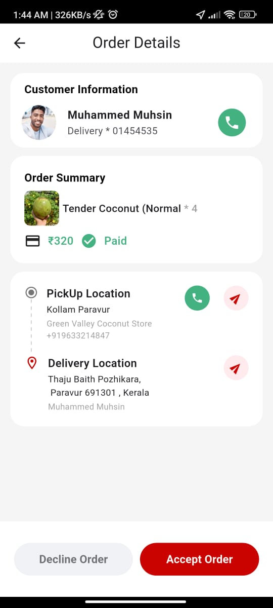
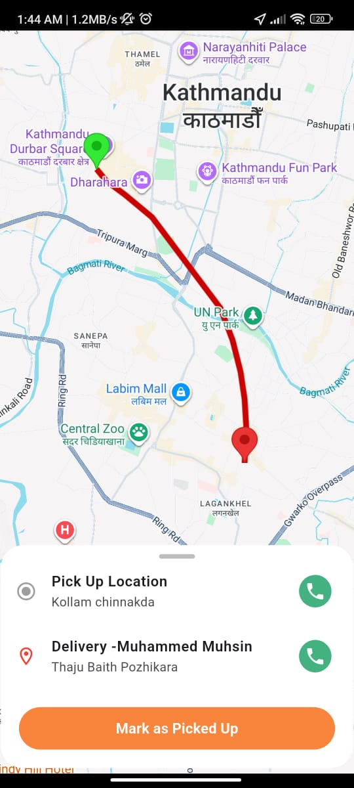
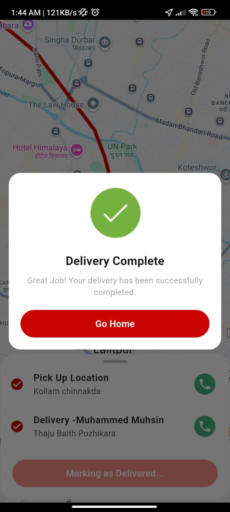

# 🚴‍♂️ Delivery Boy App

A **Flutter-based Delivery App** that allows delivery partners to manage orders, track progress, and simulate real-time delivery routes using **Google Maps**.  
This project demonstrates the full delivery workflow  from **order acceptance** to **successful delivery completion**  with smooth UI transitions and animated route visualization.

---

## 🌟 Features

✅ **Order Management**
- Accept or Decline incoming orders  
- View customer details and order summary  

✅ **Simulated Real-time Delivery Tracking**
- Integrated **Google Maps** with pickup, delivery, and driver markers  
- **Polyline-based animated route simulation** showing the driver’s movement  
- Simulated routes created from **hardcoded coordinates** (not real road paths)  

✅ **Delivery Progress Stages**
- Waiting for Acceptance  
- Order Accepted  
- Picking Up  
- En Route (Animated)  
- Destination Reached  
- Mark as Delivered  
- Delivery Completed  

✅ **Interactive UI**
- Status-based action buttons (Start Pickup, Mark as Picked Up, etc.)  
- Delivery completion confirmation overlay  
- Smooth UI transitions with `Provider` state management  

---

## ⚙️ Technical Overview

The current implementation uses **predefined LatLng points** to simulate a delivery agent moving from the pickup to the delivery location.  

- 🧩 **Simulation Logic:**  
  The delivery provider cycles through each coordinate in the route list using a timer (`Timer.periodic`) to animate movement on the map.

- 📍 **Map Layer:**  
  Markers and polylines are dynamically updated to represent the driver’s progress in real time.

- 🧭 **Note:**  
  This is a **route simulation**, not an actual navigation path.  
  Future updates will integrate the **Google Directions API** to generate real driving routes.

---

## 🗺️ Screenshots

<p align="center">
  
  
  
  
</p>

<p align="center">
  <em>Accept/Decline Order • Order Details • Delivery Map • Delivery Completed</em>
</p>

---

## 📁 Project Structure

```
  lib/
  │
  ├── models/
  │ └── order_model.dart
  │
  ├── provider/
  │ ├── current_location_provider.dart
  │ └── delivery_provider.dart
  │
  ├── screen/
  │ ├── app_main_screen.dart
  │ ├── delivery_map_screen.dart 
  │ ├── driver_home_screen.dart
  │ └── order_detail_screen.dart
  │
  ├── utils/
  │ ├── colors.dart
  │ ├── image_urls.dart
  │ └── utils.dart
  │ 
  ├── widgets/
  │ ├── custom_button.dart
  │ ├── order_on_the_way.dart
  │  ├── order_card.dart 
  │ └── dash_vertical_line.dart
  │
  ├── google_map.dart
  ├── main.dart
  └── routes.dart
---

## 🧰 Tech Stack

| Component | Technology |
|------------|-------------|
| Framework | Flutter |
| Language | Dart |
| State Management | Provider |
| Maps Integration | Google Maps Flutter |
| Location Services | Geolocator |
| Route Simulation | Flutter Polyline Points |
| UI | Material Design |


